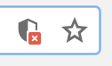
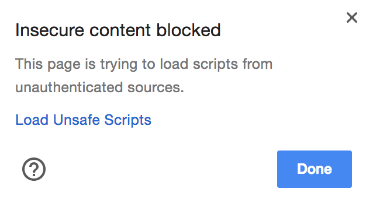

# Thermostat

Simulates a home thermostat, including powersaving mode and integrated London weather.

## App in Action

## Setup

Head to https://thermostat123.herokuapp.com/

The weather comes from a script running a third-party API called [OpenWeatherMap](https://openweathermap.org/). Chrome sees this as unsafe, so just need to load it to see the current weather, as below.

In the address bar in the browser, click the shield icon

Click Load Unsafe Scripts

You'll see the weather pop in at the bottom of the page.

## Usage

Users can control the thermostat with the buttons, raising and lowering the temperature. The thermostat also includes at powersaving mode, which is toggled with the T/P button. When powersaving is on, the temperature can only go up to 25 degrees, when off it can rise to the maximum of 32 degrees. Users can also reset the temperature back to the default of 20 degrees. Users can also view the current temperature outside in London.

## Testing

 Testing was accomplished using the [Jasmine](https://jasmine.github.io/) framework. You can find the tests [here](site/jasmine-standalone-3.1.0/spec/ThermostatSpec.js). It was the first time testing JavaScript, so I was happy to see the syntax of Jasmine is remarkably similar to the RSpec syntax, which I had used prior to that. It made the testing side of the project easily manageable.

## My Approach

As it was my first week writing JavaScript I approached the project with an open mind. I knew that jQuery was involved at some point but didn't know how. Once I got to grips with JS, rewriting Fizzbuzz and another project I had previously done in Ruby, I got stuck into JS's contructors and prototypes. I found it difficult to wrap my head around the fact that almost everything in JS is an object, but once I did it made everything I had done make sense.

Using 3rd party API's was also something I thoroughly enjoyed as I had always wanted to be able to do that, long before I started Makers Academy. I used the OpenWeatherMap API, which once I understood the steps I needed to take, I found easy to use and provided great information, all for free.

This was also the week which we were allowed a lot more freedom to explore CSS, so I mostly just tried some features out on this project, which is why it currently looks a bit "unpolished".

Finally, I had wanted to deploy an app I had created to Heroku for some time and I finally got the opportunity to do so. Using the Heroku guides and some trial and error I managed to get the deployment up and running with relative ease. It felt great to be able to show people my work by visiting the site on my smartphone. It has turned out to be my favourite project week so far in Makers Academy.

## Future Additions

I am looking to improve this project so it is up to a standard I am happy with. I want to change the styling so it looks more professional and also make it look better when viewing it on mobile. I would also like to explore using API's more, maybe to add some more features, whether from OpenWeatherMap or otherwise. One example is adding a city selector so users can see the temperature in any city they want, rather than just in London.
